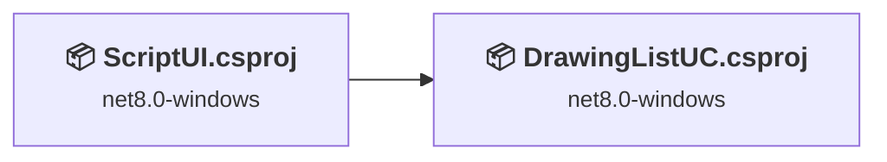
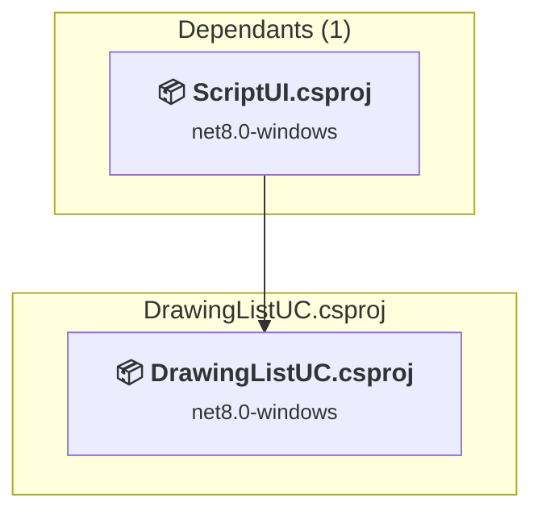
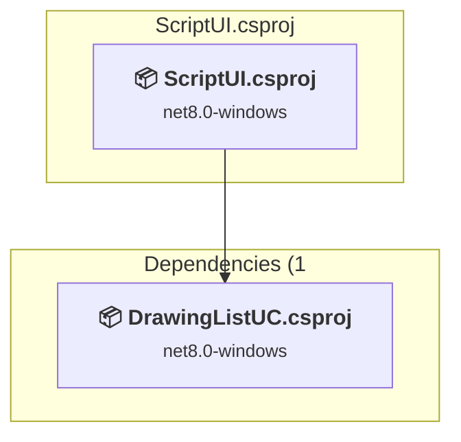

# Projects and dependencies analysis

This document provides a comprehensive overview of the projects and their dependencies in the context of upgrading to .NETCoreApp,Version=v10.0.

## Table of Contents

- [Executive Summary](#executive-Summary)
  - [Highlevel Metrics](#highlevel-metrics)
  - [Projects Compatibility](#projects-compatibility)
  - [Package Compatibility](#package-compatibility)
  - [API Compatibility](#api-compatibility)
  - [Binding Redirect Configuration](#binding-redirect-configuration)
- [Aggregate NuGet packages details](#aggregate-nuget-packages-details)
- [Top API Migration Challenges](#top-api-migration-challenges)
  - [Technologies and Features](#technologies-and-features)
  - [Most Frequent API Issues](#most-frequent-api-issues)
- [Projects Relationship Graph](#projects-relationship-graph)
- [Project Details](#project-details)

  - [DrawingListUC\DrawingListUC.csproj](#drawinglistucdrawinglistuccsproj)
  - [ScriptUI\ScriptUI.csproj](#scriptuiscriptuicsproj)

## Executive Summary

### Highlevel Metrics

| Metric | Count | Status |
| :--- | :---: | :--- |
| Total Projects | 2 | All require upgrade |
| Total NuGet Packages | 0 | All compatible |
| Total Code Files | 22 |  |
| Total Code Files with Incidents | 19 |  |
| Total Lines of Code | 7294 |  |
| Total Number of Issues | 3168 |  |
| Estimated LOC to modify | 3166+ | at least 43,4% of codebase |

### Projects Compatibility

| Project | Target Framework | Difficulty | Package Issues | API Issues | Binding Issues | Est. LOC Impact | Description |
| :--- | :---: | :---: | :---: | :---: | :---: | :---: | :--- |
| [DrawingListUC\DrawingListUC.csproj](#drawinglistucdrawinglistuccsproj) | net8.0-windows | 🟡 Medium | 0 | 3045 | 0 | 3045+ | ClassLibrary, Sdk Style = True |
| [ScriptUI\ScriptUI.csproj](#scriptuiscriptuicsproj) | net8.0-windows | 🟡 Medium | 0 | 121 | 0 | 121+ | Wpf, Sdk Style = True |

### Package Compatibility

| Status | Count | Percentage |
| :--- | :---: | :---: |
| ✅ Compatible | 0 | 0,0% |
| ⚠️ Incompatible | 0 | 0,0% |
| 🔄 Upgrade Recommended | 0 | 0,0% |
| ***Total NuGet Packages*** | ***0*** | ***100%*** |

### API Compatibility

| Category | Count | Impact |
| :--- | :---: | :--- |
| 🔴 Binary Incompatible | 3078 | High - Require code changes |
| 🟡 Source Incompatible | 85 | Medium - Needs re-compilation and potential conflicting API error fixing |
| 🔵 Behavioral change | 3 | Low - Behavioral changes that may require testing at runtime |
| ✅ Compatible | 4704 |  |
| ***Total APIs Analyzed*** | ***7870*** |  |

## Aggregate NuGet packages details

| Package | Current Version | Suggested Version | Projects | Description |
| :--- | :---: | :---: | :--- | :--- |

## Top API Migration Challenges

### Technologies and Features

| Technology | Issues | Percentage | Migration Path |
| :--- | :---: | :---: | :--- |
| Windows Forms | 2996 | 94,6% | Windows Forms APIs for building Windows desktop applications with traditional Forms-based UI that are available in .NET on Windows. Enable Windows Desktop support: Option 1 (Recommended): Target net9.0-windows; Option 2: Add <UseWindowsDesktop>true</UseWindowsDesktop>; Option 3 (Legacy): Use Microsoft.NET.Sdk.WindowsDesktop SDK. |
| GDI+ / System.Drawing | 76 | 2,4% | System.Drawing APIs for 2D graphics, imaging, and printing that are available via NuGet package System.Drawing.Common. Note: Not recommended for server scenarios due to Windows dependencies; consider cross-platform alternatives like SkiaSharp or ImageSharp for new code. |
| Legacy Configuration System | 9 | 0,3% | Legacy XML-based configuration system (app.config/web.config) that has been replaced by a more flexible configuration model in .NET Core. The old system was rigid and XML-based. Migrate to Microsoft.Extensions.Configuration with JSON/environment variables; use System.Configuration.ConfigurationManager NuGet package as interim bridge if needed. |
| Windows Forms Legacy Controls | 1 | 0,0% | Legacy Windows Forms controls that have been removed from .NET Core/5+ including StatusBar, DataGrid, ContextMenu, MainMenu, MenuItem, and ToolBar. These controls were replaced by more modern alternatives. Use ToolStrip, MenuStrip, ContextMenuStrip, and DataGridView instead. |

### Most Frequent API Issues

| API | Count | Percentage | Category |
| :--- | :---: | :---: | :--- |
| T:System.Windows.Forms.Button | 170 | 5,4% | Binary Incompatible |
| T:System.Windows.Forms.AnchorStyles | 139 | 4,4% | Binary Incompatible |
| T:System.Windows.Forms.TextBox | 133 | 4,2% | Binary Incompatible |
| T:System.Windows.Forms.GroupBox | 96 | 3,0% | Binary Incompatible |
| T:System.Windows.Forms.ToolStripMenuItem | 96 | 3,0% | Binary Incompatible |
| T:System.Windows.Forms.Label | 93 | 2,9% | Binary Incompatible |
| T:System.Windows.Forms.ListView | 86 | 2,7% | Binary Incompatible |
| T:System.Windows.Forms.DialogResult | 85 | 2,7% | Binary Incompatible |
| T:System.Windows.Forms.CheckBox | 60 | 1,9% | Binary Incompatible |
| T:System.Windows.Forms.Control.ControlCollection | 59 | 1,9% | Binary Incompatible |
| P:System.Windows.Forms.Control.Controls | 59 | 1,9% | Binary Incompatible |
| P:System.Windows.Forms.Control.Name | 58 | 1,8% | Binary Incompatible |
| P:System.Windows.Forms.Control.Size | 56 | 1,8% | Binary Incompatible |
| M:System.Windows.Forms.Control.ControlCollection.Add(System.Windows.Forms.Control) | 55 | 1,7% | Binary Incompatible |
| P:System.Windows.Forms.TextBox.Text | 52 | 1,6% | Binary Incompatible |
| P:System.Windows.Forms.Control.TabIndex | 51 | 1,6% | Binary Incompatible |
| P:System.Windows.Forms.Control.Location | 51 | 1,6% | Binary Incompatible |
| T:System.Windows.Forms.AutoScaleMode | 48 | 1,5% | Binary Incompatible |
| T:System.Windows.Forms.RadioButton | 43 | 1,4% | Binary Incompatible |
| T:System.Windows.Forms.Panel | 41 | 1,3% | Binary Incompatible |
| T:System.Windows.Forms.ToolStripButton | 40 | 1,3% | Binary Incompatible |
| T:System.Windows.Forms.ColumnHeader | 37 | 1,2% | Binary Incompatible |
| T:System.Windows.Forms.ContextMenuStrip | 32 | 1,0% | Binary Incompatible |
| T:System.Windows.Forms.Padding | 30 | 0,9% | Binary Incompatible |
| T:System.Windows.Forms.MessageBox | 29 | 0,9% | Binary Incompatible |
| T:System.Windows.Forms.ToolStripItemCollection | 28 | 0,9% | Binary Incompatible |
| T:System.Windows.Forms.ListView.ListViewItemCollection | 24 | 0,8% | Binary Incompatible |
| P:System.Windows.Forms.ListView.Items | 24 | 0,8% | Binary Incompatible |
| T:System.Windows.Forms.ToolStripItem | 24 | 0,8% | Binary Incompatible |
| P:System.Windows.Forms.ToolStripItemCollection.Item(System.Int32) | 24 | 0,8% | Binary Incompatible |
| P:System.Windows.Forms.ToolStrip.Items | 22 | 0,7% | Binary Incompatible |
| T:System.Windows.MessageBoxResult | 22 | 0,7% | Binary Incompatible |
| P:System.Windows.Forms.Control.Anchor | 21 | 0,7% | Binary Incompatible |
| P:System.Windows.Forms.ButtonBase.UseVisualStyleBackColor | 21 | 0,7% | Binary Incompatible |
| P:System.Windows.Forms.ButtonBase.Text | 21 | 0,7% | Binary Incompatible |
| T:System.Drawing.ContentAlignment | 21 | 0,7% | Source Incompatible |
| F:System.Windows.Forms.AnchorStyles.Right | 20 | 0,6% | Binary Incompatible |
| T:System.Windows.Forms.MessageBoxButtons | 20 | 0,6% | Binary Incompatible |
| F:System.Windows.Forms.AnchorStyles.Top | 19 | 0,6% | Binary Incompatible |
| P:System.Windows.Forms.ToolStripItem.Name | 19 | 0,6% | Binary Incompatible |
| T:System.Windows.Forms.ProgressBar | 19 | 0,6% | Binary Incompatible |
| M:System.Windows.Forms.MessageBox.Show(System.String) | 17 | 0,5% | Binary Incompatible |
| P:System.Windows.Forms.ToolStripItem.Text | 17 | 0,5% | Binary Incompatible |
| P:System.Windows.Forms.ToolStripItem.Size | 17 | 0,5% | Binary Incompatible |
| T:System.Windows.RoutedEventArgs | 17 | 0,5% | Binary Incompatible |
| P:System.Windows.Forms.ContainerControl.AutoScaleMode | 16 | 0,5% | Binary Incompatible |
| P:System.Windows.Forms.ContainerControl.AutoScaleDimensions | 16 | 0,5% | Binary Incompatible |
| F:System.Windows.Forms.DialogResult.OK | 16 | 0,5% | Binary Incompatible |
| E:System.Windows.Forms.Control.Click | 15 | 0,5% | Binary Incompatible |
| M:System.Windows.Forms.Control.SuspendLayout | 15 | 0,5% | Binary Incompatible |

## Projects Relationship Graph

Legend:
📦 SDK-style project
⚙️ Classic project

## Project Details

### DrawingListUC\DrawingListUC.csproj

#### Project Info

- **Current Target Framework:** net8.0-windows
- **Proposed Target Framework:** net10.0--windows
- **SDK-style**: True
- **Project Kind:** ClassLibrary
- **Dependencies**: 0
- **Dependants**: 1
- **Number of Files**: 23
- **Number of Files with Incidents**: 14
- **Lines of Code**: 6409
- **Estimated LOC to modify**: 3045+ (at least 47,5% of the project)

#### Dependency Graph

Legend:
📦 SDK-style project
⚙️ Classic project

### API Compatibility

| Category | Count | Impact |
| :--- | :---: | :--- |
| 🔴 Binary Incompatible | 2962 | High - Require code changes |
| 🟡 Source Incompatible | 83 | Medium - Needs re-compilation and potential conflicting API error fixing |
| 🔵 Behavioral change | 0 | Low - Behavioral changes that may require testing at runtime |
| ✅ Compatible | 4394 |  |
| ***Total APIs Analyzed*** | ***7439*** |  |

#### Project Technologies and Features

| Technology | Issues | Percentage | Migration Path |
| :--- | :---: | :---: | :--- |
| Legacy Configuration System | 7 | 0,2% | Legacy XML-based configuration system (app.config/web.config) that has been replaced by a more flexible configuration model in .NET Core. The old system was rigid and XML-based. Migrate to Microsoft.Extensions.Configuration with JSON/environment variables; use System.Configuration.ConfigurationManager NuGet package as interim bridge if needed. |
| GDI+ / System.Drawing | 76 | 2,5% | System.Drawing APIs for 2D graphics, imaging, and printing that are available via NuGet package System.Drawing.Common. Note: Not recommended for server scenarios due to Windows dependencies; consider cross-platform alternatives like SkiaSharp or ImageSharp for new code. |
| Windows Forms Legacy Controls | 1 | 0,0% | Legacy Windows Forms controls that have been removed from .NET Core/5+ including StatusBar, DataGrid, ContextMenu, MainMenu, MenuItem, and ToolBar. These controls were replaced by more modern alternatives. Use ToolStrip, MenuStrip, ContextMenuStrip, and DataGridView instead. |
| Windows Forms | 2962 | 97,3% | Windows Forms APIs for building Windows desktop applications with traditional Forms-based UI that are available in .NET on Windows. Enable Windows Desktop support: Option 1 (Recommended): Target net9.0-windows; Option 2: Add <UseWindowsDesktop>true</UseWindowsDesktop>; Option 3 (Legacy): Use Microsoft.NET.Sdk.WindowsDesktop SDK. |

### ScriptUI\ScriptUI.csproj

#### Project Info

- **Current Target Framework:** net8.0-windows
- **Proposed Target Framework:** net10.0-windows
- **SDK-style**: True
- **Project Kind:** Wpf
- **Dependencies**: 1
- **Dependants**: 0
- **Number of Files**: 26
- **Number of Files with Incidents**: 5
- **Lines of Code**: 885
- **Estimated LOC to modify**: 121+ (at least 13,7% of the project)

#### Dependency Graph

Legend:
📦 SDK-style project
⚙️ Classic project

### API Compatibility

| Category | Count | Impact |
| :--- | :---: | :--- |
| 🔴 Binary Incompatible | 116 | High - Require code changes |
| 🟡 Source Incompatible | 2 | Medium - Needs re-compilation and potential conflicting API error fixing |
| 🔵 Behavioral change | 3 | Low - Behavioral changes that may require testing at runtime |
| ✅ Compatible | 310 |  |
| ***Total APIs Analyzed*** | ***431*** |  |

#### Project Technologies and Features

| Technology | Issues | Percentage | Migration Path |
| :--- | :---: | :---: | :--- |
| Legacy Configuration System | 2 | 1,7% | Legacy XML-based configuration system (app.config/web.config) that has been replaced by a more flexible configuration model in .NET Core. The old system was rigid and XML-based. Migrate to Microsoft.Extensions.Configuration with JSON/environment variables; use System.Configuration.ConfigurationManager NuGet package as interim bridge if needed. |
| Windows Forms | 34 | 28,1% | Windows Forms APIs for building Windows desktop applications with traditional Forms-based UI that are available in .NET on Windows. Enable Windows Desktop support: Option 1 (Recommended): Target net9.0-windows; Option 2: Add <UseWindowsDesktop>true</UseWindowsDesktop>; Option 3 (Legacy): Use Microsoft.NET.Sdk.WindowsDesktop SDK. |
